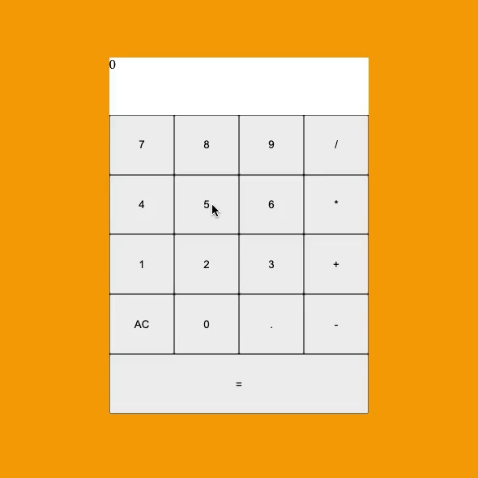

# Js-Calculator

## What I created

This is a Javascript web calculator. The purpose of this app is to test my knowledge on compenents.  

## What I learned

* How to use React components.  
* How to follow facebook React documentation.
* Learn about playing audio.
* Code a component once and reuse it again.
* Implemented math functions to calculate any basic math.
